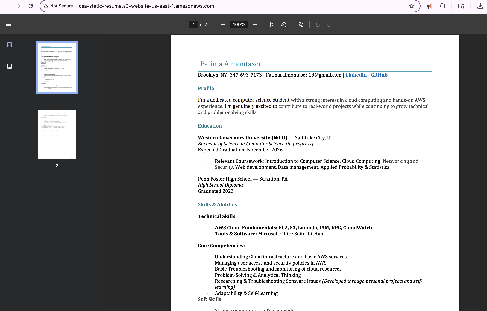
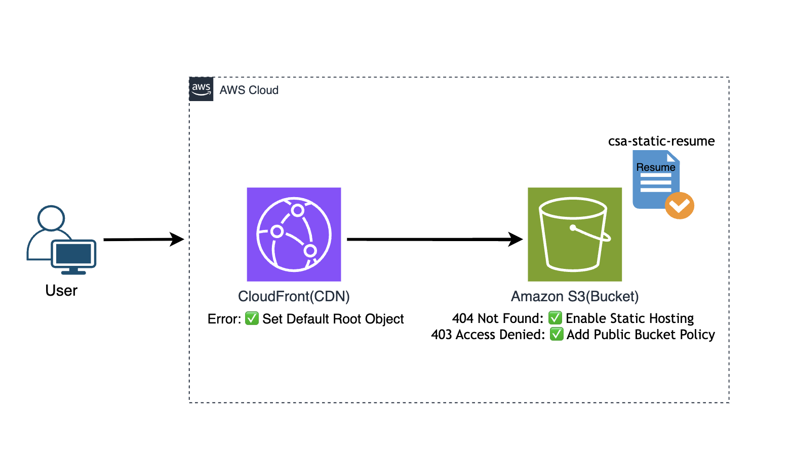

# Deploying a Static Resume on AWS with S3 and CloudFront: A Troubleshooting Project

**Objective:** Host a resume file using Amazon S3 with secure public access, then integrate CloudFront to enable HTTPS encryption and Content Delivery Network (CDN) for low-latency access through edge caching

**Services Used:** Amazon S3, Amazon CloudFront

**Errors Resolved:**
* **404 Not Found:** Resolved by enabling static website hosting on the S3 bucket and setting `csa-resume.pdf` as index document.
* **403 Access Denied:** Resolved by implementing a bucket policy granting public read access.
* **CloudFront Root Object Error:** Corrected by setting default root object to `csa-resume.pdf`

**Outcome:** The resume is now accessible globally via HTTPS with automatic encryption and CDN edge caching.

---

### 1. Initial S3 Bucket Configuration

* Created an S3 bucket named: csa-static-resume in the us-east-1 region.
* Uploaded the resume object file: csa-resume.pdf.
* Disabled the default "Block Public Access" settings. Which is enabled by default as a security measure, and would have prevented the bucket from ever becoming public.

### 2. S3 Errors Encountered and Resolved

>> I tried to access the website and encountered a 404 Not Found error. Upon reviewing the S3 bucket configuration, I realized that static website hosting had not been enabled.


* **Error 1: 404 Not Found (Configuration Error)**
    * **Root Cause:** Static website hosting was not enabled for the S3 bucket.
    * **Solution:** Enabled static website hosting for the csa-static-resume bucket.
      - **Production Note:** For enhanced security, Origin Access Control (OAC) would restrict access to CloudFront only, eliminating public bucket exposure.
    * **Implementation Path:**
      * AWS S3 Console → Select csa-static-resume bucket → Properties tab → Static website hosting section → Enabled hosting.
      * Set the Index document to csa-resume.pdf. (Note: The index document name must precisely match the uploaded filename.)


>> After enabling static website hosting, I encountered a 403 Access Denied error when accessing the URL.


* **Error 2: 403 Access Denied (Security Error)**
    * **Root Cause:** S3 buckets are private by default. Even with "Block Public Access" disabled, explicit permissions are needed via bucket policies for public access.
    * **Solution:** Created and applied a bucket policy granting `s3:GetObject` permission.
    * **Implementation Path:**
    * S3 Console → Select bucket → Permissions tab → Bucket Policy → Edit 
    ``` json
    {
      "Version": "2012-10-17",
      "Statement": [{
        "Effect": "Allow",          // Allow access
        "Principal": "*",           // For all users
        "Action": "s3:GetObject",   // to download/view files
        "Resource": "arn:aws:s3:::csa-static-resume/*"  // On all objects within this bucket
      }]
    }
    ```
>> *Security Note: This policy grants minimal `s3:GetObject` permission only - following least-privilege security best practices.*


### 4. Key Technical Takeaways from S3 Configuration

* **Troubleshooting Methodology:** Successfully differentiated between a configuration error (404 - static hosting not enabled) and a security error (403 - insufficient permissions).
* **AWS Best Practices:** Used bucket policies(recommended over legacy ACLs)
* **Security:** Implemented minimal required permissions 

**S3 HTTP Endpoint:** 'http://csa-static-resume.s3-website-us-east-1.amazonaws.com/'


---

### 3. Amazon CloudFront CDN Configuration

Integrated CloudFront to add HTTPS security, improve global access, and enable edge caching.

**Configuration Process**: 
(I used the legacy console settings to demonstrate the HTTP to HTTPS redirect and default behavior in the new console if needed)
* **Origin Domain:** csa-static-resume.s3-website-us-east-1.amazonaws.com
* **Viewer Protocol Policy:** "Redirect HTTP to HTTPS" to ensure that any requests coming in over an unsecure HTTP connection are automatically redirected to a secure HTTPS connection.
* **SSL Certificate:** CloudFront's automatically managed SSL certificate  
  *(Provided by default for *.cloudfront.net domains)*


>> After configuration, I attempted to access the CloudFront domain name and encountered an error.

* **Error:** When accessing the root URL (https://d24vu2jciv84ft.cloudfront.net/), CloudFront returned an error because it didn't know which object to serve by default.  
  
* **Root Cause:** CloudFront requires a default object configuration for root path (`/`) requests. 
* **Fix:** Set the Default root object field to `csa-resume.pdf` This instructs CloudFront to serve this specific file when a user accesses the URL.


**With CloudFront:**
* **Low-Latency Global Delivery:*** 
  Enabled Content Delivery Network (CDN) caching at AWS's 450+ global edge locations. This accelerates content delivery by serving cached copies geographically closer to users, significantly reducing latency worldwide. 
* **Automatic HTTPS Security:**  
   Encryption enabled via CloudFront-managed SSL certificates (zero configuration)


**Final URL:** https://d24vu2jciv84ft.cloudfront.net/


### 4. Security Enhancement Analysis

While the bucket policy solution successfully resolved the initial 403 error, I recognized an important security consideration for production environments:

**Origin Access Control (OAC) Implementation:**
- **Current Approach:** S3 bucket policy with `"Principal": "*"` allows public internet access to the bucket
- **Production Recommendation:** Use Origin Access Control (OAC) to:
  - Make the S3 bucket completely private (remove public bucket policy)
  - Grant access ONLY to the specific CloudFront distribution
  - Eliminate public internet exposure while maintaining functionality
  - Follow the principle of least privilege more strictly

This demonstrates the evolution from a functional learning solution to a production-ready, security-conscious architecture.

### Project Architecture Diagram

I created this diagram to illustrate the request workflow, from the user through CloudFront to the S3 origin, and to show the configuration fixes applied along the way.



