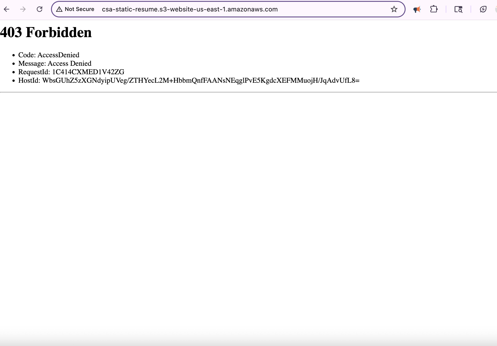

# Deploying a Static Resume Website on AWS with S3 and CloudFront: A Troubleshooting Project

**Objective:** Host a resume file using Amazon S3 with secure public access, then integrate CloudFront to enable HTTPS encryption and Content Delivery Network (CDN) caching for global delivery.

Host a resume using Amazon S3 with appropriate public permissions. Subsequently, integrate Amazon CloudFront to enable SSL (HTTPS) and leverage its global Content Delivery Network (CDN) caching for low-latency access.

**Services Used:** Amazon S3, Amazon CloudFront

**Errors Resolved:**
* **404 Not Found:** Resolved by enabling static website hosting on the S3 bucket and explicitly setting csa-resume.pdf as the index document.
* **403 Access Denied:** Resolved by implementing a bucket policy that grants public read access to the S3 bucket contents.
* **CloudFront Root Object Misconfiguration:** Corrected by setting default root object to `csa-resume.pdf`

**Outcome:** The resume is now accessible globally via HTTPS with automatic encryption and edge caching.

---

### 1. Initial S3 Bucket Configuration

* Created an S3 bucket named: csa-static-resume in the us-east-1 region.
* Uploaded the resume object file: csa-resume.pdf.
* Disabled the default "Block Public Access" settings. Which is enabled by default as a security measure, would have prevented the bucket from ever becoming public.

### 2. S3 Errors Encountered and Resolved

>> I tried to access the website and encountered a 404 Not Found error. Upon reviewing the S3 bucket configuration, I realized that static website hosting had not been enabled.


* **Error 1: 404 Not Found (Configuration Error)**
    * **Root Cause:** Static website hosting was not enabled for the S3 bucket.
    * **Solution:** Enabled static website hosting for the csa-static-resume bucket.
    * **Implementation Path:** AWS S3 Console → Select csa-static-resume bucket → Properties tab → Static website hosting section → Enabled hosting. Set the Index document to csa-resume.pdf. (Note: The index document name must precisely match the uploaded filename.)


>> After enabling static website hosting, I attempted to access the website endpoint again and encountered a 403 Access Denied error.



* **Error 2: 403 Access Denied (Security Error)**
    * **Root Cause:** By default, all S3 buckets and their objects are private, regardless of the "Block Public Access" settings. Even with public access blocked off, specific permissions are required to allow public read access to the bucket's contents for website hosting. My bucket lacked the necessary "permission slip" in the form of a bucket policy to allow public read operations.
    * **Solution:** Created and applied a bucket policy to the csa-static-resume bucket granting public read access.
    * **Implementation Path:**
    * AWS S3 Console → Select csa-static-resume bucket → Permissions tab → Bucket Policy section → Edit. Pasted the following JSON policy:
    ``` json
    {
      "Version": "2012-10-17",
      "Statement": [{
        "Effect": "Allow",          // "Allow access"
        "Principal": "*",           // "to all users
        "Action": "s3:GetObject",   // "to download/view files"
        "Resource": "arn:aws:s3:::csa-static-resume/*"  // On all objects within this bucket
      }]
    }
    ```


### 4. Key Technical Takeaways from S3 Configuration

* **Troubleshooting Methodology:** Successfully differentiated between a configuration error (404 - static hosting not enabled) and a security error (403 - insufficient permissions).
* **AWS Best Practices:** Utilized bucket policies, which are the recommended method for granting public access to S3 buckets, over the older Access Control Lists (ACLs).
* **Adaptability:** Effectively resolved access issues by understanding and applying AWS's modern security framework for S3.

**Final S3 Configuration Endpoint (HTTP):** [(http://csa-static-resume.s3-website-us-east-1.amazonaws.com/)](http://csa-static-resume.s3-website-us-east-1.amazonaws.com/)


---

### 3. Amazon CloudFront CDN Configuration for Enhanced Access

Integrated CloudFront with the S3-hosted PDF resume to enable HTTPS and leverage AWS's global infrastructure for improved performance.

**Configuration Process**: 
(During CloudFront distribution creation, I used the legacy console settings to demonstrate the HTTP to HTTPS redirect and default behavior in the new console if needed)
* **Origin Domain:** csa-static-resume.s3-website-us-east-1.amazonaws.com
* **Viewer Protocol Policy:** "Redirect HTTP to HTTPS" to ensure that any requests coming in over an unsecure HTTP connection are automatically redirected to a secure HTTPS connection.
* **SSL Certificate:** Utilized the default automatically managed SSL certificates for CloudFront distributions. Which CloudFront provides by default for its .cloudfront.net domain.


>> After the initial CloudFront configuration, I attempted to access the CloudFront domain name and encountered an error. The issue was that when a user requests the root URL (`/`), CloudFront needs to know which object to serve as the default. 
* **Error:** When accessing the root URL of the CloudFront distribution (e.g., https://d24vu2jciv84ft.cloudfront.net/), CloudFront did not know which specific object to serve by default.
  
* **Cause:** Missing Default Root Object for `/` requests
* **Fix:** Set the Default root object field to `csa-resume.pdf` This instructs CloudFront to serve this specific file when a user accesses the distribution's root URL.


**With CloudFront:**
* Global Access**: Accelerated delivery via CDN using AWS's 450+ edge locations. Content is now cached at CloudFront's edge locations worldwide, reducing latency for users accessing the resume from different geographic locations.
* Automatic Security**: HTTPS encryption enabled
* SSL (AWS-managed): Leveraged AWS CloudFront domain's default SSL certificate management.


**Final Access URL:** https://d24vu2jciv84ft.cloudfront.net/


### Project Architecture Diagram

This diagram shows how the AWS services are connected to host the resume website, from the user's request all the way to the S3 bucket.


